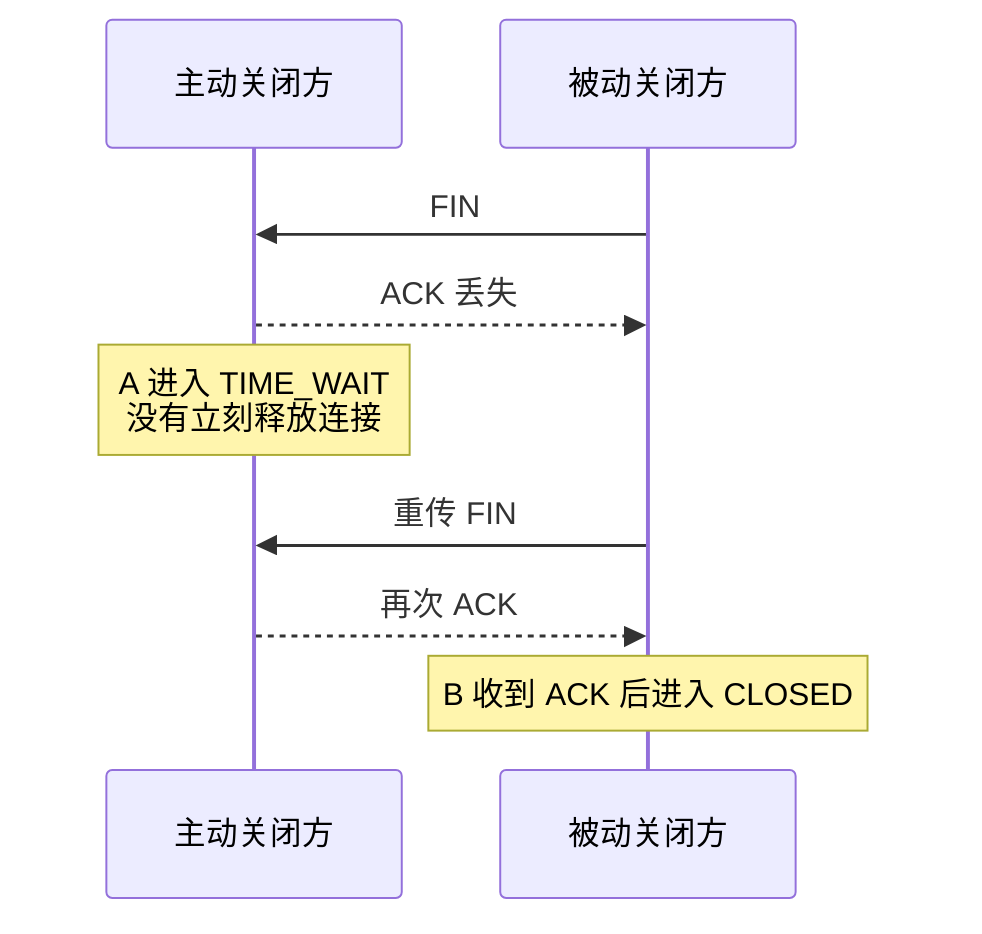

# java-interview-real-v1 — Test Human Review

Each item must be approved by a human before the reviewed JSONL is created.

## 1. java_real_candidate_011 — TERMINOLOGY

- [ ] Evidence offsets replay exactly
- [ ] Question sounds like a real Java backend interview
- [ ] Answer is concise, grounded, and adds no external fact
- [ ] Multi/Hard-Negative relationship is logically valid (if applicable)

**Question:** Spring Boot 自动装配指什么？

**Reference Answer:** Spring Boot 自动装配可以理解为：通过注解或少量配置，让 Spring Boot 帮助应用启用一块功能。

**Evidence 1:** `JavaGuide/docs/system-design/framework/spring/spring-boot-auto-assembly-principles.md` offset `[2566, 3373)`

我们现在提到自动装配的时候，一般会和 Spring Boot 联系在一起。但是，实际上 Spring Framework 早就实现了这个功能。Spring Boot 只是在其基础上，通过 SPI 的方式，做了进一步优化。

> 在 Spring Boot 2.6 及更早版本中，自动配置类主要通过外部 jar 包中的 `META-INF/spring.factories` 注册。Spring Boot 2.7 引入了 `META-INF/spring/org.springframework.boot.autoconfigure.AutoConfiguration.imports`，同时兼容旧的注册方式；Spring Boot 3.0 移除了通过 `spring.factories` 中 `EnableAutoConfiguration` key 注册自动配置类的支持，但 `spring.factories` 的其他用途不受影响。

没有 Spring Boot 的情况下，如果我们需要引入第三方依赖，需要手动配置，非常麻烦。但是，Spring Boot 中，我们直接引入一个 starter 即可。比如你想要在项目中使用 redis 的话，直接在项目中引入对应的 starter 即可。

```xml
<dependency>
    <groupId>org.springframework.boot</groupId>
    <artifactId>spring-boot-starter-data-redis</artifactId>
</dependency>
```

引入 starter 之后，我们通过少量注解和一些简单的配置就能使用第三方组件提供的功能了。

在我看来，自动装配可以简单理解为：**通过注解或者一些简单的配置就能在 Spring Boot 的帮助下实现某块功能。**


## 2. java_real_candidate_012 — TERMINOLOGY

- [ ] Evidence offsets replay exactly
- [ ] Question sounds like a real Java backend interview
- [ ] Answer is concise, grounded, and adds no external fact
- [ ] Multi/Hard-Negative relationship is logically valid (if applicable)

**Question:** TCP 的 RTO 是什么，设置过大或过小分别有什么影响？

**Reference Answer:** RTO 是从发送数据开始计算的重传超时时间，超时后执行重传。设置过小会产生不必要的重传并增加网络负担；设置过大会拉长传输延迟并降低吞吐量，因此应随网络状况动态调整。

**Evidence 1:** `JavaGuide/docs/cs-basics/network/tcp-reliability-guarantee.md` offset `[4845, 5451)`

先看表里的第一行：**超时重传（RTO）**。它是 TCP 重传机制的兜底方案。无论有没有 SACK、有没有触发快速重传，只要某段数据发出去以后迟迟没有等到 ACK，最终都要靠 RTO 来判断“不能再等了，该重传了”。

当发送方发送数据之后，它会启动一个定时器，等待目的端确认收到这个报文段。接收端对已成功收到的 TCP 段发回相应的 ACK。如果发送端在合理的往返时延（RTT）内未收到确认，那么对应的数据段就会被认为可能已经丢失，并进行重传。

- **RTT（Round Trip Time）**：往返时间，也就是 TCP 段从发出去到收到对应 ACK 的时间。
- **RTO（Retransmission Time Out）**：重传超时时间，即从数据发送时刻算起，超过这个时间便执行重传。


RTO 的确定是一个关键问题，因为它直接影响到 TCP 的性能和效率。如果 RTO 设置得太小，会导致不必要的重传，增加网络负担；如果 RTO 设置得太大，会导致数据传输的延迟，降低吞吐量。因此，RTO 应该根据网络的实际状况，动态地进行调整。


## 3. java_real_candidate_017 — TERMINOLOGY

- [ ] Evidence offsets replay exactly
- [ ] Question sounds like a real Java backend interview
- [ ] Answer is concise, grounded, and adds no external fact
- [ ] Multi/Hard-Negative relationship is logically valid (if applicable)

**Question:** 什么是数据库事务？

**Reference Answer:** 数据库事务把多个数据库操作组织成一个逻辑整体，这些操作要么全部成功，要么全部不执行。

**Evidence 1:** `JavaGuide/docs/database/mysql/mysql-questions-01.md` offset `[22859, 23424)`

大多数情况下，我们在谈论事务的时候，如果没有特指**分布式事务**，往往指的就是**数据库事务**。

数据库事务在我们日常开发中接触的最多了。如果你的项目属于单体架构的话，你接触到的往往就是数据库事务了。

**那数据库事务有什么作用呢？**

简单来说，数据库事务可以保证多个对数据库的操作（也就是 SQL 语句）构成一个逻辑上的整体。构成这个逻辑上的整体的这些数据库操作遵循：**要么全部执行成功,要么全部不执行** 。

```sql
# 开启一个事务
START TRANSACTION;
# 多条 SQL 语句
SQL1,SQL2...
## 提交事务
COMMIT;
```


另外，关系型数据库（例如：`MySQL`、`SQL Server`、`Oracle` 等）事务都有 **ACID** 特性：


## 4. java_real_candidate_018 — TERMINOLOGY

- [ ] Evidence offsets replay exactly
- [ ] Question sounds like a real Java backend interview
- [ ] Answer is concise, grounded, and adds no external fact
- [ ] Multi/Hard-Negative relationship is logically valid (if applicable)

**Question:** 什么是本地缓存，它的主要性能优势是什么？

**Reference Answer:** 本地缓存位于应用进程内部，不需要额外的网络访问，因此请求速度很快；它适用于数据量不大且没有分布式要求的场景。

**Evidence 1:** `JavaGuide/docs/database/redis/cache-basics.md` offset `[1778, 2273)`

这个实际在很多项目中用的蛮多，特别是单体架构的时候。数据量不大，并且没有分布式要求的话，使用本地缓存还是可以的。

本地缓存位于应用内部，其最大的优点是应用存在于同一个进程内部，请求本地缓存的速度非常快，不存在额外的网络开销。

常见的单体架构图如下，我们使用 **Nginx** 来做**负载均衡**，部署两个相同的应用到服务器，两个服务使用同一个数据库，并且使用的是本地缓存。


**注意：** 在集群模式下使用本地缓存，必须考虑**负载均衡策略**。如果 Nginx 使用默认的**轮询（Round-Robin）**，同一个用户的请求会随机落在不同机器，导致本地缓存命中率极低。解决方案如下：

1. **网关层**：使用一致性哈希或 Sticky Session，保证同一用户的请求固定打到同一台机器。
2. **应用层**：仅将本地缓存用于**“全局几乎不变”**的数据（如配置字典），而非用户维度数据。


## 5. java_real_candidate_019 — TERMINOLOGY

- [ ] Evidence offsets replay exactly
- [ ] Question sounds like a real Java backend interview
- [ ] Answer is concise, grounded, and adds no external fact
- [ ] Multi/Hard-Negative relationship is logically valid (if applicable)

**Question:** 什么是分布式缓存？

**Reference Answer:** 分布式缓存是一种独立于应用运行、为多个应用共同提供缓存数据的内存数据库服务；即使同一服务部署在多台机器上，也可以共享同一份缓存。

**Evidence 1:** `JavaGuide/docs/database/redis/cache-basics.md` offset `[3681, 4145)`

我们可以把分布式缓存（Distributed Cache） 看作是一种内存数据库的服务，它的最终作用就是提供缓存数据的服务。

分布式缓存脱离于应用独立存在，多个应用可直接的共同使用同一个分布式缓存服务。

如下图所示，就是一个简单的使用分布式缓存的架构图。我们使用 Nginx 来做负载均衡，部署两个相同的应用到服务器，两个服务使用同一个数据库和缓存。


使用分布式缓存之后，缓存服务可以部署在一台单独的服务器上，即使同一个相同的服务部署在多台机器上，也是使用的同一份缓存。 并且，单独的分布式缓存服务的性能、容量和提供的功能都要更加强大。

**软件系统设计中没有银弹，往往任何技术的引入都像是把双刃剑。** 你使用的方式得当，就能为系统带来很大的收益。否则，只是费了精力不讨好。

简单来说，为系统引入分布式缓存之后往往会带来下面这些问题：


## 6. java_real_candidate_023 — TERMINOLOGY

- [ ] Evidence offsets replay exactly
- [ ] Question sounds like a real Java backend interview
- [ ] Answer is concise, grounded, and adds no external fact
- [ ] Multi/Hard-Negative relationship is logically valid (if applicable)

**Question:** 什么是 I/O 多路复用？

**Reference Answer:** I/O 多路复用换了个思路：把所有要监听的文件描述符（fd）交给内核，让线程阻塞在一个专门的监听系统调用上。

**Evidence 1:** `JavaGuide/docs/cs-basics/operating-system/io-multiplexing.md` offset `[831, 1390)`

要讲清楚，得先知道一次网络读操作在内核里其实分成两个阶段：

1. **等数据就绪**：数据还在网卡、还在路上，内核要等它到达并拷进内核缓冲区。这一步往往很慢。
2. **拷数据**：数据到了内核缓冲区，再从内核态拷到用户态的应用缓冲区。这一步很快。


一个连接一个线程的阻塞模型，问题出在第一阶段：线程调用 `recv` 后就卡死在那儿，专门为这一个连接等数据，等的时候什么也干不了。

I/O 多路复用换了个思路：把所有要监听的文件描述符（fd）交给内核，让线程阻塞在一个专门的监听系统调用上。只要这批 fd 里有任意一个就绪，这个调用就返回，告诉你谁可以读、谁可以写了，然后你再去处理那几个就绪的 fd。

打个比方：一个服务员同时管十张桌子，不是站在第一桌死等客人想好菜，而是来回扫一眼，哪桌举手了就去哪桌。

**多路** 指的是多个连接，**复用** 指的是复用同一个线程去处理它们。


## 7. java_real_candidate_046 — PARAPHRASE

- [ ] Evidence offsets replay exactly
- [ ] Question sounds like a real Java backend interview
- [ ] Answer is concise, grounded, and adds no external fact
- [ ] Multi/Hard-Negative relationship is logically valid (if applicable)

**Question:** TCP 建立连接为什么需要三次握手，握手本身能否保证数据可靠交付？

**Reference Answer:** 三次握手用于同步双方的初始序列号，并确认双方收发路径可用；握手本身不负责数据可靠交付，后续还要依赖确认、重传、窗口控制和拥塞控制。

**Evidence 1:** `JavaGuide/docs/cs-basics/network/tcp-connection-and-disconnection.md` offset `[4211, 4300)`

TCP 三次握手主要做两件事：**同步双方的初始序列号**，并且**确认双方的收发路径是可用的**。真正的数据可靠交付，还要依赖后续传输过程中的确认、重传、窗口控制和拥塞控制。


## 8. java_real_candidate_050 — PARAPHRASE

- [ ] Evidence offsets replay exactly
- [ ] Question sounds like a real Java backend interview
- [ ] Answer is concise, grounded, and adds no external fact
- [ ] Multi/Hard-Negative relationship is logically valid (if applicable)

**Question:** IoC 主要解决了什么问题？

**Reference Answer:** IoC 把对象及其依赖交给第三方容器管理，主要解决对象之间耦合过高和资源不易统一管理的问题。

**Evidence 1:** `JavaGuide/docs/system-design/framework/spring/ioc-and-aop.md` offset `[1051, 1752)`

IoC 的思想就是两方之间不互相依赖，由第三方容器来管理相关资源。这样有什么好处呢？

1. 对象之间的耦合度或者说依赖程度降低；
2. 资源变的容易管理；比如你用 Spring 容器提供的话很容易就可以实现一个单例。

例如：现有一个针对 User 的操作，利用 Service 和 Dao 两层结构进行开发

在没有使用 IoC 思想的情况下，Service 层想要使用 Dao 层的具体实现的话，需要通过 new 关键字在`UserServiceImpl` 中手动 new 出 `IUserDao` 的具体实现类 `UserDaoImpl`（不能直接 new 接口类）。

很完美，这种方式也是可以实现的，但是我们想象一下如下场景：

开发过程中突然接到一个新的需求，针对`IUserDao` 接口开发出另一个具体实现类。因为 Server 层依赖了`IUserDao`的具体实现，所以我们需要修改`UserServiceImpl`中 new 的对象。如果只有一个类引用了`IUserDao`的具体实现，可能觉得还好，修改起来也不是很费力气，但是如果有许许多多的地方都引用了`IUserDao`的具体实现的话，一旦需要更换`IUserDao` 的实现方式，那修改起来将会非常的头疼。


## 9. java_real_candidate_052 — PARAPHRASE

- [ ] Evidence offsets replay exactly
- [ ] Question sounds like a real Java backend interview
- [ ] Answer is concise, grounded, and adds no external fact
- [ ] Multi/Hard-Negative relationship is logically valid (if applicable)

**Question:** AOP 解决了什么问题？

**Reference Answer:** AOP 把日志、事务、权限等横切关注点从核心业务逻辑中抽离，减少这些公共行为在多个类中的重复实现，从而降低代码冗余和维护复杂度。

**Evidence 1:** `JavaGuide/docs/system-design/framework/spring/ioc-and-aop.md` offset `[4207, 4663)`

OOP 不能很好地处理一些分散在多个类或对象中的公共行为（如日志记录、事务管理、权限控制、接口限流、接口幂等等），这些行为通常被称为 **横切关注点（cross-cutting concerns）** 。如果我们在每个类或对象中都重复实现这些行为，那么会导致代码的冗余、复杂和难以维护。

AOP 可以将横切关注点（如日志记录、事务管理、权限控制、接口限流、接口幂等等）从 **核心业务逻辑（core concerns，核心关注点）** 中分离出来，实现关注点的分离。


以日志记录为例进行介绍，假如我们需要对某些方法进行统一格式的日志记录，没有使用 AOP 技术之前，我们需要挨个写日志记录的逻辑代码，全是重复的逻辑。


## 10. java_real_candidate_054 — PARAPHRASE

- [ ] Evidence offsets replay exactly
- [ ] Question sounds like a real Java backend interview
- [ ] Answer is concise, grounded, and adds no external fact
- [ ] Multi/Hard-Negative relationship is logically valid (if applicable)

**Question:** MyISAM 和 InnoDB 在锁、事务与外键支持上有什么区别？

**Reference Answer:** MyISAM 只支持表级锁，不支持事务和外键；InnoDB 支持行级锁与表级锁，也支持事务和外键。

**Evidence 1:** `JavaGuide/docs/database/mysql/mysql-questions-01.md` offset `[12153, 12809)`

MySQL 5.5 之前，MyISAM 引擎是 MySQL 的默认存储引擎，可谓是风光一时。

虽然，MyISAM 的性能还行，各种特性也还不错（比如全文索引、压缩、空间函数等）。但是，MyISAM 不支持事务和行级锁，而且最大的缺陷就是崩溃后无法安全恢复。

MySQL 5.5 版本之后，InnoDB 是 MySQL 的默认存储引擎。

言归正传！咱们下面还是来简单对比一下两者：

**1、是否支持行级锁**

MyISAM 只有表级锁(table-level locking)，而 InnoDB 支持行级锁(row-level locking)和表级锁,默认为行级锁。

也就说，MyISAM 一锁就是锁住了整张表，这在并发写的情况下是多么滴憨憨啊！这也是为什么 InnoDB 在并发写的时候，性能更牛皮了！

**2、是否支持事务**

MyISAM 不提供事务支持。

InnoDB 提供事务支持，实现了 SQL 标准定义了四个隔离级别，具有提交(commit)和回滚(rollback)事务的能力。并且，InnoDB 默认使用的 REPEATABLE-READ（可重读）隔离级别是可以解决幻读问题发生的（基于 MVCC 和 Next-Key Lock）。

关于 MySQL 事务的详细介绍，可以看看我写的这篇文章：[MySQL 事务隔离级别详解](./transaction-isolation-level.md)。

**3、是否支持外键**

MyISAM 不支持，而 InnoDB 支持。


## 11. java_real_candidate_056 — PARAPHRASE

- [ ] Evidence offsets replay exactly
- [ ] Question sounds like a real Java backend interview
- [ ] Answer is concise, grounded, and adds no external fact
- [ ] Multi/Hard-Negative relationship is logically valid (if applicable)

**Question:** TCP 主动关闭方在最后一次 ACK 后为什么要等待 2MSL？

**Reference Answer:** 等待 2MSL 一方面让主动关闭方在最后 ACK 丢失、对端重传 FIN 时仍能再次回复 ACK，另一方面尽量让旧连接中延迟的报文从网络里消失。

**Evidence 1:** `JavaGuide/docs/cs-basics/network/tcp-connection-and-disconnection.md` offset `[11030, 11571)`

第四次挥手时，主动关闭方发送给被动关闭方的最后一个 ACK 可能丢失。如果被动关闭方没有收到 ACK，就会重传 FIN。主动关闭方还在 `TIME_WAIT` 里，就能再次回复 ACK。

如果主动关闭方发完最后一个 ACK 后立刻进入 `CLOSED`，当对端重传 FIN 到达时，本端可能已经没有对应连接状态，只能回复 RST，导致对端看到异常关闭或连接被重置。



**MSL（Maximum Segment Lifetime）** 是报文段在网络中的最大生存时间。2MSL 不是一次请求-响应的最大 RTT，而是一个保守等待窗口：既给最后 ACK 丢失后的 FIN 重传留出处理机会，也尽量保证旧连接中的延迟报文从网络中消失。


## 12. java_real_candidate_057 — PARAPHRASE

- [ ] Evidence offsets replay exactly
- [ ] Question sounds like a real Java backend interview
- [ ] Answer is concise, grounded, and adds no external fact
- [ ] Multi/Hard-Negative relationship is logically valid (if applicable)

**Question:** DATETIME 和 TIMESTAMP 应该按什么条件选择？

**Reference Answer:** 需要数据库自动处理时区转换，并且时间位于 1970-01-01 00:00:01 UTC 至 2038-01-19 03:14:07.999999 UTC 范围内时，可选 TIMESTAMP；不需要时区转换、由应用控制时区，或需要表示该范围之外的时间时，DATETIME 更稳妥。

**Evidence 1:** `JavaGuide/docs/database/mysql/mysql-questions-01.md` offset `[5405, 6000)`

DATETIME 类型没有时区信息，TIMESTAMP 和时区有关。

TIMESTAMP 只需要使用 4 个字节的存储空间，但是 DATETIME 需要耗费 8 个字节的存储空间。但是，这样同样造成了一个问题，Timestamp 表示的时间范围更小。

- DATETIME：'1000-01-01 00:00:00.000000' 到 '9999-12-31 23:59:59.999999'
- Timestamp：'1970-01-01 00:00:01.000000' UTC 到 '2038-01-19 03:14:07.999999' UTC

`TIMESTAMP` 的核心优势在于其内建的时区处理能力。数据库负责 UTC 存储和基于会话时区的自动转换，简化了需要处理多时区应用的开发。如果应用需要处理多时区，或者希望数据库能自动管理时区转换，`TIMESTAMP` 是自然的选择（注意其时间范围限制，也就是 2038 年问题）。

如果应用场景不涉及时区转换，或者希望应用程序完全控制时区逻辑，并且需要表示 2038 年之后的时间，`DATETIME` 是更稳妥的选择。

关于两者的详细对比以及日期存储类型选择建议，请参考我写的这篇文章： [MySQL 时间类型数据存储建议](./some-thoughts-on-database-storage-time.md)。


## 13. java_real_candidate_058 — PARAPHRASE

- [ ] Evidence offsets replay exactly
- [ ] Question sounds like a real Java backend interview
- [ ] Answer is concise, grounded, and adds no external fact
- [ ] Multi/Hard-Negative relationship is logically valid (if applicable)

**Question:** 不可重复读和幻读分别指什么？

**Reference Answer:** 不可重复读是同一事务再次读取同一记录时，其内容或存在性因其他事务修改、删除而变化；幻读是重复执行同一范围查询时，符合条件的记录集合出现新增或消失。

**Evidence 1:** `JavaGuide/docs/database/mysql/mysql-questions-01.md` offset `[26228, 26592)`

- 不可重复读：同一事务内，同一条记录被其他事务修改或删除，导致再次读取时记录内容或存在性发生变化。
- 幻读：同一事务内，同一个范围条件查询多次执行时，符合条件的记录集合发生变化，出现新增或消失的记录。

幻读其实可以看作是不可重复读的一种特殊情况，单独把幻读区分出来的原因主要是解决幻读和不可重复读的方案不一样。

举个例子：执行 `delete` 和 `update` 操作的时候，可以直接对记录加锁，保证事务安全。而执行 `insert` 操作的时候，由于记录锁（Record Lock）只能锁住已经存在的记录，为了避免插入新记录，需要依赖间隙锁（Gap Lock）。也就是说执行 `insert` 操作的时候需要依赖 Next-Key Lock（Record Lock+Gap Lock） 进行加锁来保证不出现幻读。


## 14. java_real_candidate_059 — PARAPHRASE

- [ ] Evidence offsets replay exactly
- [ ] Question sounds like a real Java backend interview
- [ ] Answer is concise, grounded, and adds no external fact
- [ ] Multi/Hard-Negative relationship is logically valid (if applicable)

**Question:** Redis AOF 为什么在命令执行完成后才记日志，这样做有什么风险？

**Reference Answer:** 命令执行后再写 AOF 可以避免语法检查开销，也不会阻塞当前命令；风险是 Redis 在日志落盘前宕机会丢失对应修改，而且写日志可能阻塞后续命令。

**Evidence 1:** `JavaGuide/docs/database/redis/redis-persistence.md` offset `[7870, 8240)`

关系型数据库（如 MySQL）通常都是执行命令之前记录日志（方便故障恢复），而 Redis AOF 持久化机制是在执行完命令之后再记录日志。


**为什么是在执行完命令之后记录日志呢？**

- 避免额外的检查开销，AOF 记录日志不会对命令进行语法检查；
- 在命令执行完之后再记录，不会阻塞当前的命令执行。

这样也带来了风险（我在前面介绍 AOF 持久化的时候也提到过）：

- 如果刚执行完命令 Redis 就宕机会导致对应的修改丢失；
- 可能会阻塞后续其他命令的执行（AOF 记录日志是在 Redis 主线程中进行的）。


## 15. java_real_candidate_063 — PARAPHRASE

- [ ] Evidence offsets replay exactly
- [ ] Question sounds like a real Java backend interview
- [ ] Answer is concise, grounded, and adds no external fact
- [ ] Multi/Hard-Negative relationship is logically valid (if applicable)

**Question:** 第 2 次握手已经传回 ACK，为什么还要传回 SYN？

**Reference Answer:** 第二次握手里的 ACK 是为了确认“服务端收到了客户端的 SYN”，也就是确认 C→S 方向的请求已经到达。简言之：ACK 表示“我收到了你的 SYN”，SYN 表示“我也要同步我的初始序列号，请你确认”。

**Evidence 1:** `JavaGuide/docs/cs-basics/network/tcp-connection-and-disconnection.md` offset `[6586, 6907)`

第二次握手里的 ACK 是为了确认“服务端收到了客户端的 SYN”，也就是确认 C→S 方向的请求已经到达。

同时携带 SYN，是因为服务端也需要把自己的 ISN 同步给客户端，并要求客户端确认。只有双方的 ISN 都完成同步，后续可靠传输才有共同的序列号起点。

简言之：ACK 表示“我收到了你的 SYN”，SYN 表示“我也要同步我的初始序列号，请你确认”。

> SYN（Synchronize Sequence Numbers）是 TCP 建立连接时使用的同步信号。客户端先发送 SYN，服务端使用 SYN+ACK 应答，最后客户端再用 ACK 确认。这样双方才能完成初始序列号同步，建立一条可用于可靠数据传输的 TCP 连接。


## 16. java_real_candidate_067 — DIRECT_FACT

- [ ] Evidence offsets replay exactly
- [ ] Question sounds like a real Java backend interview
- [ ] Answer is concise, grounded, and adds no external fact
- [ ] Multi/Hard-Negative relationship is logically valid (if applicable)

**Question:** Redis RedLock 设计分布式锁时要满足哪三个关键点？

**Reference Answer:** 三个关键点是互斥、不能死锁和容错；容错要求只要大部分 Redis 节点成功创建锁即可。

**Evidence 1:** `advanced-java/docs/distributed-system/distributed-lock-redis-vs-zookeeper.md` offset `[230, 352)`

官方叫做 `RedLock` 算法，是 Redis 官方支持的分布式锁算法。

这个分布式锁有 3 个重要的考量点：

-   互斥（只能有一个客户端获取锁）
-   不能死锁
-   容错（只要大部分 Redis 节点创建了这把锁就可以）


## 17. java_real_candidate_068 — DIRECT_FACT

- [ ] Evidence offsets replay exactly
- [ ] Question sounds like a real Java backend interview
- [ ] Answer is concise, grounded, and adds no external fact
- [ ] Multi/Hard-Negative relationship is logically valid (if applicable)

**Question:** 大型电商商品详情页中，商品变更如何同步到用户侧页面？

**Reference Answer:** 商品变更先写入 MQ，缓存服务消费消息后调用数据服务取得新数据并写入 Redis；Nginx 本地缓存过期时从 Redis 拉取最新数据，用户访问时再把本地数据动态渲染进 HTML 模板。

**Evidence 1:** `advanced-java/docs/high-availability/e-commerce-website-detail-page-architecture.md` offset `[780, 1301)`

大型电商网站商品详情页的系统设计中，当商品数据发生变更时，会将变更消息压入 MQ 消息队列中。**缓存服务**从消息队列中消费这条消息时，感知到有数据发生变更，便通过调用数据服务接口，获取变更后的数据，然后将整合好的数据推送至 redis 中。Nginx 本地缓存的数据是有一定的时间期限的，比如说 10 分钟，当数据过期之后，它就会从 redis 获取到最新的缓存数据，并且缓存到自己本地。

用户浏览网页时，动态将 Nginx 本地数据渲染到本地 html 模板并返回给用户。


虽然没有直接返回 html 页面那么快，但是因为数据在本地缓存，所以也很快，其实耗费的也就是动态渲染一个 html 页面的性能。如果 html 模板发生了变更，不需要将所有的页面重新静态化，也不需要发送请求，没有网络请求的开销，直接将数据渲染进最新的 html 页面模板后响应即可。

在这种架构下，我们需要**保证系统的高可用性**。


## 18. java_real_candidate_074 — DIRECT_FACT

- [ ] Evidence offsets replay exactly
- [ ] Question sounds like a real Java backend interview
- [ ] Answer is concise, grounded, and adds no external fact
- [ ] Multi/Hard-Negative relationship is logically valid (if applicable)

**Question:** Java 静态变量有什么特点？

**Reference Answer:** 静态变量被类的所有实例共享，只分配一份内存，并可通过类名访问。

**Evidence 1:** `JavaGuide/docs/java/basis/java-basic-questions-01.md` offset `[34037, 34567)`

静态变量也就是被 `static` 关键字修饰的变量。它可以被类的所有实例共享，无论一个类创建了多少个对象，它们都共享同一份静态变量。也就是说，静态变量只会被分配一次内存，即使创建多个对象，这样可以节省内存。


静态变量是通过类名来访问的，例如 `StaticVariableExample.staticVar`（如果被 `private` 关键字修饰就无法这样访问了）。

```java
public class StaticVariableExample {
    // 静态变量
    public static int staticVar = 0;
}
```

通常情况下，静态变量会被 `final` 关键字修饰成为常量。

```java
public class ConstantVariableExample {
    // 常量
    public static final int constantVar = 0;
}
```


## 19. java_real_candidate_082 — DIRECT_FACT

- [ ] Evidence offsets replay exactly
- [ ] Question sounds like a real Java backend interview
- [ ] Answer is concise, grounded, and adds no external fact
- [ ] Multi/Hard-Negative relationship is logically valid (if applicable)

**Question:** ArrayList 在头尾和指定位置插入、删除的时间复杂度分别是多少？

**Reference Answer:** 头部或指定位置插入、删除通常需要移动元素，复杂度为 O(n)；容量足够时尾部插入为 O(1)，尾部删除也为 O(1)，扩容时尾插会额外产生 O(n) 复制。

**Evidence 1:** `JavaGuide/docs/java/collection/java-collection-questions-01.md` offset `[5346, 5788)`

对于插入：

- 头部插入：由于需要将所有元素都依次向后移动一个位置，因此时间复杂度是 O(n)。
- 尾部插入：当 `ArrayList` 的容量未达到极限时，往列表末尾插入元素的时间复杂度是 O(1)，因为它只需要在数组末尾添加一个元素即可；当容量已达到极限并且需要扩容时，则需要执行一次 O(n) 的操作将原数组复制到新的更大的数组中，然后再执行 O(1) 的操作添加元素。
- 指定位置插入：需要将目标位置之后的所有元素都向后移动一个位置，然后再把新元素放入指定位置。这个过程需要移动平均 n/2 个元素，因此时间复杂度为 O(n)。

对于删除：

- 头部删除：由于需要将所有元素依次向前移动一个位置，因此时间复杂度是 O(n)。
- 尾部删除：当删除的元素位于列表末尾时，时间复杂度为 O(1)。
- 指定位置删除：需要将目标元素之后的所有元素向前移动一个位置以填补被删除的空白位置，因此需要移动平均 n/2 个元素，时间复杂度为 O(n)。

这里简单列举一个例子：


## 20. java_real_candidate_087 — DIRECT_FACT

- [ ] Evidence offsets replay exactly
- [ ] Question sounds like a real Java backend interview
- [ ] Answer is concise, grounded, and adds no external fact
- [ ] Multi/Hard-Negative relationship is logically valid (if applicable)

**Question:** 严格来说，Java 创建线程的唯一方式是什么？

**Reference Answer:** 严格来说，Java 创建线程只有一种方式：调用 `new Thread().start()`。继承 Thread、实现 Runnable 或 Callable、使用线程池或 CompletableFuture 等只是使用多线程的方式，最终仍依赖 `new Thread().start()`。

**Evidence 1:** `JavaGuide/docs/java/concurrent/java-concurrent-questions-01.md` offset `[3763, 4013)`

一般来说，创建线程有很多种方式，例如继承 `Thread` 类、实现 `Runnable` 接口、实现 `Callable` 接口、使用线程池、使用 `CompletableFuture` 类等等。

不过，这些方式其实并没有真正创建出线程。准确点来说，这些都属于是在 Java 代码中使用多线程的方法。

严格来说，Java 就只有一种方式可以创建线程，那就是通过 `new Thread().start()` 创建。不管是哪种方式，最终还是依赖于 `new Thread().start()`。


## 21. java_real_candidate_093 — DIRECT_FACT

- [ ] Evidence offsets replay exactly
- [ ] Question sounds like a real Java backend interview
- [ ] Answer is concise, grounded, and adds no external fact
- [ ] Multi/Hard-Negative relationship is logically valid (if applicable)

**Question:** 消息队列通常给系统带来哪三项核心收益？

**Reference Answer:** 三项核心收益是异步处理、削峰或限流，以及降低系统耦合性。

**Evidence 1:** `JavaGuide/docs/high-performance/message-queue/message-queue.md` offset `[1504, 1679)`

通常来说，使用消息队列主要能为我们的系统带来下面三点好处：

1. 异步处理
2. 削峰/限流
3. 降低系统耦合性

除了这三点之外，消息队列还有其他的一些应用场景，例如实现分布式事务、顺序保证和数据流处理。

如果在面试的时候你被面试官问到这个问题的话，一般情况是你在你的简历上涉及到消息队列这方面的内容，这个时候推荐你结合你自己的项目来回答。


## 22. java_real_candidate_098 — DIRECT_FACT

- [ ] Evidence offsets replay exactly
- [ ] Question sounds like a real Java backend interview
- [ ] Answer is concise, grounded, and adds no external fact
- [ ] Multi/Hard-Negative relationship is logically valid (if applicable)

**Question:** HotSpot 对象的内存布局包含哪些部分？

**Reference Answer:** 在 Hotspot 虚拟机中，对象在内存中的布局可以分为 3 块区域：对象头（Header）、实例数据（Instance Data）和对齐填充（Padding）。HotSpot 会按对象对齐边界分配对象，默认对齐通常是 8 字节，也可受 -XX:ObjectAlignmentInBytes 等配置影响。

**Evidence 1:** `JavaGuide/docs/java/jvm/memory-area.md` offset `[22295, 22788)`

在 Hotspot 虚拟机中，对象在内存中的布局可以分为 3 块区域：**对象头（Header）**、**实例数据（Instance Data）**和**对齐填充（Padding）**。

对象头包括两部分信息：

1. 标记字段（Mark Word）：用于存储对象自身的运行时数据，如哈希码（HashCode）、GC 分代年龄、锁状态等；偏向线程 ID、偏向时间戳只适用于仍实现并启用偏向锁的旧版 HotSpot。
2. 类型指针（Klass pointer）：对象指向它的类元数据的指针，虚拟机通过这个指针来确定这个对象是哪个类的实例。

**实例数据部分是对象真正存储的有效信息**，也是在程序中所定义的各种类型的字段内容。

**对齐填充部分不是必然存在的，也没有什么特别的含义，仅仅起占位作用。** HotSpot 会按对象对齐边界分配对象，默认对齐通常是 8 字节，也可受 `-XX:ObjectAlignmentInBytes` 等配置影响。因此对象总大小需要补齐到对齐边界；对象头本身并不保证总是 8 字节的整数倍，例如启用压缩类指针时常见的对象头大小是 12 字节。


## 23. java_real_candidate_099 — DIRECT_FACT

- [ ] Evidence offsets replay exactly
- [ ] Question sounds like a real Java backend interview
- [ ] Answer is concise, grounded, and adds no external fact
- [ ] Multi/Hard-Negative relationship is logically valid (if applicable)

**Question:** Spring AOP 创建代理时如何选择 JDK Proxy 和 CGLIB？

**Reference Answer:** 目标对象实现接口时，Spring AOP 可使用 JDK Proxy；没有可用接口时会使用 CGLIB 创建目标类的子类代理。

**Evidence 1:** `JavaGuide/docs/system-design/framework/spring/ioc-and-aop.md` offset `[6801, 7374)`

AOP 的常见实现方式有动态代理、字节码操作等方式。

Spring AOP 就是基于动态代理的，如果要代理的对象，实现了某个接口，那么 Spring AOP 会使用 **JDK Proxy**，去创建代理对象，而对于没有实现接口的对象，就无法使用 JDK Proxy 去进行代理了，这时候 Spring AOP 会使用 CGLIB 生成一个被代理对象的子类来作为代理，如下图所示：


**Spring Boot 和 Spring 的动态代理的策略是不是也是一样的呢？**其实不一样，很多人都理解错了。

Spring Boot 2.0 之前，`spring.aop.proxy-target-class` 默认值为 `false`，有用户接口时通常使用 **JDK 动态代理**；如果目标类没有可用接口，Spring AOP 仍会回退到 **CGLIB 动态代理**，并不会仅仅因为目标类没有实现接口就抛出异常。Spring Boot 1.5.x 自动配置 AOP 代码如下：


## 24. java_real_candidate_105 — DIRECT_FACT

- [ ] Evidence offsets replay exactly
- [ ] Question sounds like a real Java backend interview
- [ ] Answer is concise, grounded, and adds no external fact
- [ ] Multi/Hard-Negative relationship is logically valid (if applicable)

**Question:** MySQL InnoDB 的默认隔离级别是什么？

**Reference Answer:** MySQL InnoDB 存储引擎的默认隔离级别是 REPEATABLE READ。

**Evidence 1:** `JavaGuide/docs/database/mysql/mysql-questions-01.md` offset `[28758, 29135)`

MySQL InnoDB 存储引擎的默认隔离级别是 **REPEATABLE READ**。可以通过以下命令查看：

- MySQL 8.0 之前：`SELECT @@tx_isolation;`
- MySQL 8.0 及之后：`SELECT @@transaction_isolation;`

```sql
mysql> SELECT @@tx_isolation;
+-----------------+
| @@tx_isolation  |
+-----------------+
| REPEATABLE-READ |
+-----------------+
```

关于 MySQL 事务隔离级别的详细介绍，可以看看我写的这篇文章：[MySQL 事务隔离级别详解](./transaction-isolation-level.md)。


## 25. java_real_candidate_113 — DIRECT_FACT

- [ ] Evidence offsets replay exactly
- [ ] Question sounds like a real Java backend interview
- [ ] Answer is concise, grounded, and adds no external fact
- [ ] Multi/Hard-Negative relationship is logically valid (if applicable)

**Question:** Redis 有哪些内存淘汰策略？

**Reference Answer:** Redis 提供 volatile-lru、volatile-ttl、volatile-random、allkeys-lru、allkeys-random、no-eviction，以及 4.0 后增加的 volatile-lfu 和 allkeys-lfu。

**Evidence 1:** `JavaGuide/docs/database/redis/redis-questions-01.md` offset `[26004, 26727)`

1. **volatile-lru（least recently used）**：从已设置过期时间的数据集（`server.db[i].expires`）中挑选最近最少使用的数据淘汰。
2. **volatile-ttl**：从已设置过期时间的数据集（`server.db[i].expires`）中挑选将要过期的数据淘汰。
3. **volatile-random**：从已设置过期时间的数据集（`server.db[i].expires`）中任意选择数据淘汰。
4. **allkeys-lru（least recently used）**：从数据集（`server.db[i].dict`）中移除最近最少使用的数据淘汰。
5. **allkeys-random**：从数据集（`server.db[i].dict`）中任意选择数据淘汰。
6. **no-eviction**（默认内存淘汰策略）：禁止驱逐数据，当内存不足以容纳新写入数据时，新写入操作会报错。

4.0 版本后增加以下两种：

7. **volatile-lfu（least frequently used）**：从已设置过期时间的数据集（`server.db[i].expires`）中挑选最不经常使用的数据淘汰。
8. **allkeys-lfu（least frequently used）**：从数据集（`server.db[i].dict`）中移除最不经常使用的数据淘汰。

`allkeys-xxx` 表示从所有的键值中淘汰数据，而 `volatile-xxx` 表示从设置了过期时间的键值中淘汰数据。

`config.c` 中定义了内存淘汰策略的枚举数组：


## 26. java_real_candidate_114 — DIRECT_FACT

- [ ] Evidence offsets replay exactly
- [ ] Question sounds like a real Java backend interview
- [ ] Answer is concise, grounded, and adds no external fact
- [ ] Multi/Hard-Negative relationship is logically valid (if applicable)

**Question:** 三次握手过程中可以携带数据吗？

**Reference Answer:** 普通 TCP 中，第三次握手的 ACK 可以携带数据。如果第三次握手的 ACK 丢失，但客户端随后发送了一个携带数据且带 ACK 标志的报文，服务端收到后可以把它视为有效的第三次握手确认。

**Evidence 1:** `JavaGuide/docs/cs-basics/network/tcp-connection-and-disconnection.md` offset `[6929, 7231)`

普通 TCP 中，第三次握手的 ACK 可以携带数据。RFC 9293 也允许连接同步阶段出现携带数据的报文，但接收端在确认数据有效前，不能把这部分数据交付给应用；通常需要等连接进入 `ESTABLISHED` 后，应用层才能读到这些数据。

如果第三次握手的 ACK 丢失，但客户端随后发送了一个携带数据且带 ACK 标志的报文，服务端收到后可以把它视为有效的第三次握手确认。连接被认为建立后，服务端再继续处理该数据。

需要注意，这和 TCP Fast Open（TFO）不是一回事。TFO 讨论的是第一次 SYN 就携带应用数据，需要客户端、服务端和系统配置共同支持，不是普通 TCP 默认行为。


## 27. java_real_candidate_119 — UNANSWERABLE

- [ ] Evidence offsets replay exactly
- [ ] Question sounds like a real Java backend interview
- [ ] Answer is concise, grounded, and adds no external fact
- [ ] Multi/Hard-Negative relationship is logically valid (if applicable)

**Question:** ClickHouse MergeTree 的 parts 合并策略如何影响写放大？

**Reference Answer:** 当前语料没有足够证据回答该问题。

## 28. java_real_candidate_120 — UNANSWERABLE

- [ ] Evidence offsets replay exactly
- [ ] Question sounds like a real Java backend interview
- [ ] Answer is concise, grounded, and adds no external fact
- [ ] Multi/Hard-Negative relationship is logically valid (if applicable)

**Question:** Linux eBPF verifier 如何证明循环能够终止？

**Reference Answer:** 当前语料没有足够证据回答该问题。

## 29. java_real_candidate_123 — UNANSWERABLE

- [ ] Evidence offsets replay exactly
- [ ] Question sounds like a real Java backend interview
- [ ] Answer is concise, grounded, and adds no external fact
- [ ] Multi/Hard-Negative relationship is logically valid (if applicable)

**Question:** Istio ambient mesh 中 ztunnel 的数据面职责是什么？

**Reference Answer:** 当前语料没有足够证据回答该问题。

## 30. java_real_candidate_134 — MULTI_SECTION

- [ ] Evidence offsets replay exactly
- [ ] Question sounds like a real Java backend interview
- [ ] Answer is concise, grounded, and adds no external fact
- [ ] Multi/Hard-Negative relationship is logically valid (if applicable)

**Question:** CMS 和 G1 都追求低停顿，但它们的回收算法不同，这会怎样影响空间碎片？

**Reference Answer:** CMS 使用标记-清除，会在回收后留下大量空间碎片。G1 整体采用标记-整理、局部采用标记-复制，具备空间整合能力，因此在碎片控制上优于 CMS。

**Evidence 1:** `JavaGuide/docs/java/jvm/jvm-garbage-collection.md` offset `[16563, 16703)`

- **对 CPU 资源敏感；**
- **无法处理浮动垃圾；**
- **它使用的回收算法-“标记-清除”算法会导致收集结束时会有大量空间碎片产生。**

**CMS 垃圾回收器在 Java 9 中已经被标记为过时(deprecated)，并在 Java 14 中被移除。**


**Evidence 2:** `JavaGuide/docs/java/jvm/jvm-garbage-collection.md` offset `[16716, 17255)`

**G1 (Garbage-First) 是一款面向服务器的垃圾收集器，主要针对配备多颗处理器及大容量内存的机器. 以极高概率满足 GC 停顿时间要求的同时，还具备高吞吐量性能特征。**

被视为 JDK1.7 中 HotSpot 虚拟机的一个重要进化特征。它具备以下特点：

- **并行与并发**：G1 能充分利用 CPU、多核环境下的硬件优势，使用多个 CPU（CPU 或者 CPU 核心）来缩短 Stop-The-World 停顿时间。部分其他收集器原本需要停顿 Java 线程执行的 GC 动作，G1 收集器仍然可以通过并发的方式让 java 程序继续执行。
- **分代收集**：虽然 G1 可以不需要其他收集器配合就能独立管理整个 GC 堆，但是还是保留了分代的概念。
- **空间整合**：与 CMS 的“标记-清除”算法不同，G1 从整体来看是基于“标记-整理”算法实现的收集器；从局部上来看是基于“标记-复制”算法实现的。
- **可预测的停顿**：这是 G1 相对于 CMS 的另一个大优势，降低停顿时间是 G1 和 CMS 共同的关注点。G1 会根据用户设置的停顿时间目标建立预测模型并选择回收集合，但该目标是软目标，并不保证每次停顿都不超过指定值。


## 31. java_real_candidate_135 — MULTI_SECTION

- [ ] Evidence offsets replay exactly
- [ ] Question sounds like a real Java backend interview
- [ ] Answer is concise, grounded, and adds no external fact
- [ ] Multi/Hard-Negative relationship is logically valid (if applicable)

**Question:** 从并发阶段和停顿控制看，CMS 与 G1 的设计重点分别是什么？

**Reference Answer:** CMS 通过并发标记、并发清除让 GC 与用户线程尽量同时工作，重点是并发收集和低停顿。G1 会依据用户设置的停顿目标建立预测模型并选择回收集合，以软目标方式追求可预测停顿。

**Evidence 1:** `JavaGuide/docs/java/jvm/jvm-garbage-collection.md` offset `[16096, 16562)`

- **初始标记：** 短暂停顿，标记直接与 root 相连的对象（根对象）；
- **并发标记：** 同时开启 GC 和用户线程，用一个闭包结构去记录可达对象。但在这个阶段结束，这个闭包结构并不能保证包含当前所有的可达对象。因为用户线程可能会不断的更新引用域，所以 GC 线程无法保证可达性分析的实时性。所以这个算法里会跟踪记录这些发生引用更新的地方。
- **重新标记：** 重新标记阶段就是为了修正并发标记期间因为用户程序继续运行而导致标记产生变动的那一部分对象的标记记录，这个阶段的停顿时间一般会比初始标记阶段的时间稍长，远远比并发标记阶段时间短
- **并发清除：** 开启用户线程，同时 GC 线程开始对未标记的区域做清扫。


从它的名字就可以看出它是一款优秀的垃圾收集器，主要优点：**并发收集、低停顿**。但是它有下面三个明显的缺点：


**Evidence 2:** `JavaGuide/docs/java/jvm/jvm-garbage-collection.md` offset `[16716, 17255)`

**G1 (Garbage-First) 是一款面向服务器的垃圾收集器，主要针对配备多颗处理器及大容量内存的机器. 以极高概率满足 GC 停顿时间要求的同时，还具备高吞吐量性能特征。**

被视为 JDK1.7 中 HotSpot 虚拟机的一个重要进化特征。它具备以下特点：

- **并行与并发**：G1 能充分利用 CPU、多核环境下的硬件优势，使用多个 CPU（CPU 或者 CPU 核心）来缩短 Stop-The-World 停顿时间。部分其他收集器原本需要停顿 Java 线程执行的 GC 动作，G1 收集器仍然可以通过并发的方式让 java 程序继续执行。
- **分代收集**：虽然 G1 可以不需要其他收集器配合就能独立管理整个 GC 堆，但是还是保留了分代的概念。
- **空间整合**：与 CMS 的“标记-清除”算法不同，G1 从整体来看是基于“标记-整理”算法实现的收集器；从局部上来看是基于“标记-复制”算法实现的。
- **可预测的停顿**：这是 G1 相对于 CMS 的另一个大优势，降低停顿时间是 G1 和 CMS 共同的关注点。G1 会根据用户设置的停顿时间目标建立预测模型并选择回收集合，但该目标是软目标，并不保证每次停顿都不超过指定值。


## 32. java_real_candidate_137 — MULTI_SECTION

- [ ] Evidence offsets replay exactly
- [ ] Question sounds like a real Java backend interview
- [ ] Answer is concise, grounded, and adds no external fact
- [ ] Multi/Hard-Negative relationship is logically valid (if applicable)

**Question:** RDB 和 AOF 到底记录的是什么？这两种记录方式对数据实时性有什么直接影响？

**Reference Answer:** RDB 保存某个时间点的内存数据快照；AOF 记录每条修改数据的命令，并按 fsync 策略落盘。因记录粒度不同，AOF 通常比周期快照具备更好的实时性。

**Evidence 1:** `JavaGuide/docs/database/redis/redis-persistence.md` offset `[1492, 1931)`

Redis 可以通过创建快照来获得存储在内存里面的数据在 **某个时间点** 上的副本。Redis 创建快照之后，可以对快照进行备份，可以将快照复制到其他服务器从而创建具有相同数据的服务器副本（Redis 主从结构，主要用来提高 Redis 性能），还可以将快照留在原地以便重启服务器的时候使用。

快照持久化是 Redis 默认采用的持久化方式，在 `redis.conf` 配置文件中默认有此下配置：

```clojure
# Redis 7.0 默认配置（单行格式）
save 3600 1 300 100 60 10000

# 各条件含义：
# - 3600 秒（1 小时）内至少有 1 个 key 变化
# - 300 秒（5 分钟）内至少有 100 个 key 变化
# - 60 秒（1 分钟）内至少有 10000 个 key 变化

# 等价于旧版多行格式：
# save 3600 1
# save 300 100
# save 60 10000
```


**Evidence 2:** `JavaGuide/docs/database/redis/redis-persistence.md` offset `[4255, 4800)`

与快照持久化相比，AOF 持久化的实时性更好。默认情况下 Redis 没有开启 AOF（append only file）方式的持久化，可以通过 `appendonly` 参数开启：

> **版本说明**：Redis 默认使用 RDB 持久化方式。若需使用 AOF，需要手动设置 `appendonly yes`。Redis 7.0 引入了 Multi-Part AOF 机制优化 AOF 性能，但并未改变默认持久化方式。

```bash
appendonly yes
```

开启 AOF 持久化后每执行一条会更改 Redis 中的数据的命令，Redis 就会将该命令写入到 AOF 缓冲区 `server.aof_buf` 中，然后再写入到 AOF 文件中（此时还在系统内核缓存区未同步到磁盘），最后再根据持久化方式（ `fsync`策略）的配置来决定何时将系统内核缓存区的数据同步到硬盘中的。

只有同步到磁盘中才算持久化保存了，否则依然存在数据丢失的风险，比如说：系统内核缓存区的数据还未同步，磁盘机器就宕机了，那这部分数据就算丢失了。

AOF 文件的保存位置和 RDB 文件的位置相同，都是通过 `dir` 参数设置的，默认的文件名是 `appendonly.aof`。


## 33. java_real_candidate_138 — MULTI_SECTION

- [ ] Evidence offsets replay exactly
- [ ] Question sounds like a real Java backend interview
- [ ] Answer is concise, grounded, and adds no external fact
- [ ] Multi/Hard-Negative relationship is logically valid (if applicable)

**Question:** RDB 后台快照和 AOF everysec 在运行期开销与故障丢数窗口上分别要注意什么？

**Reference Answer:** RDB 的 bgsave 虽由子进程执行，但 fork 本身会阻塞主线程，并带来额外内存开销。AOF everysec 对性能影响较小，通常系统崩溃最多丢失约一秒数据，但磁盘 I/O 严重时 fsync 阻塞与丢数窗口可能扩大。

**Evidence 1:** `JavaGuide/docs/database/redis/redis-persistence.md` offset `[2151, 2747)`

虽然 `bgsave` 在子进程中执行，不会阻塞主线程处理命令请求，但 **fork 操作本身是阻塞的**，且会带来额外的内存开销（下表中的为参考值，实际数值受到 CPU 性能、内存碎片率、系统负载等因素影响）：

| 数据集大小 | fork 延迟 | 额外内存占用     | 风险等级 |
| ---------- | --------- | ---------------- | -------- |
| < 1GB      | < 10ms    | ~10MB (页表复制) | 低       |
| 1-10GB     | 10-100ms  | 10-100MB         | 中       |
| 10-50GB    | 100ms-1s  | 100-500MB        | 高       |
| > 50GB     | > 1s      | > 500MB          | 极高     |

> 本文以 RDB 的 `bgsave` 为例说明 fork 性能影响，但**同样的机制也适用于 AOF 重写（`BGREWRITEAOF` 命令）**。AOF 重写同样需要 fork 子进程，同样面临 fork 延迟、COW 内存开销和 THP 风险。生产环境中，无论是 RDB 还是 AOF 重写，都需要关注 fork 相关的性能指标。


**Evidence 2:** `JavaGuide/docs/database/redis/redis-persistence.md` offset `[6988, 7634)`

为了兼顾数据和写入性能，可以考虑 `appendfsync everysec` 选项 ，让 Redis 每秒同步一次 AOF 文件，Redis 性能受到的影响较小。通常情况下，即使出现系统崩溃，用户最多只会丢失一秒之内产生的数据。当硬盘忙于执行写入操作的时候，Redis 还会优雅的放慢自己的速度以便适应硬盘的最大写入速度。

> ⚠️ **注意**：当磁盘 I/O 瓶颈严重时，Redis 主线程可能因等待 fsync 而阻塞长达 2 秒，期间数据丢失窗口扩大至 2 秒。生产环境应监控 `aof_delayed_fsync` 指标来评估磁盘健康度。

从 Redis 7.0.0 开始，Redis 使用了 **Multi Part AOF** 机制。顾名思义，Multi Part AOF 就是将原来的单个 AOF 文件拆分成多个 AOF 文件。在 Multi Part AOF 中，AOF 文件被分为三种类型，分别为：

- BASE：表示基础 AOF 文件，它一般由子进程通过重写产生，该文件最多只有一个。
- INCR：表示增量 AOF 文件，它一般会在 AOFRW 开始执行时被创建，该文件可能存在多个。
- HISTORY：表示历史 AOF 文件，它由 BASE 和 INCR AOF 变化而来，每次 AOFRW 成功完成时，本次 AOFRW 之前对应的 BASE 和 INCR AOF 都将变为 HISTORY，HISTORY 类型的 AOF 会被 Redis 自动删除。


## 34. java_real_candidate_145 — MULTI_SECTION

- [ ] Evidence offsets replay exactly
- [ ] Question sounds like a real Java backend interview
- [ ] Answer is concise, grounded, and adds no external fact
- [ ] Multi/Hard-Negative relationship is logically valid (if applicable)

**Question:** HTTP/1.1 已经有长连接，HTTP/2 为什么还要做多路复用？两者的复用粒度有什么区别？

**Reference Answer:** HTTP/1.1 长连接让多个请求复用同一条 TCP 连接，省去重复握手，但同一连接仍可能发生请求层队头阻塞。HTTP/2 在同一 TCP 连接上并行传输多个请求和响应，以多路复用减少 HTTP 层队头阻塞。

**Evidence 1:** `JavaGuide/docs/cs-basics/network/http1.0-vs-http1.1.md` offset `[1867, 2379)`

**HTTP/1.0 默认使用短连接**，也就是说，客户端和服务器每进行一次 HTTP 操作，就建立一次连接，任务结束就中断连接。当客户端浏览器访问的某个 HTML 或其他类型的 Web 页中包含有其他的 Web 资源（如 JavaScript 文件、图像文件、CSS 文件等），每遇到这样一个 Web 资源，浏览器就会重新建立一个 TCP 连接，这样就会导致有大量的“握手报文”和“挥手报文”占用了带宽。

**为了解决 HTTP/1.0 存在的资源浪费的问题，HTTP/1.1 优化为默认长连接模式。** 采用长连接模式的请求报文会通知服务端：“我向你请求连接，并且连接成功建立后，请不要关闭”。因此，该 TCP 连接将持续打开，为后续的客户端-服务端的数据交互服务。也就是说在使用长连接的情况下，当一个网页打开完成后，客户端和服务器之间用于传输 HTTP 数据的 TCP 连接不会关闭，客户端再次访问这个服务器时，会继续使用这一条已经建立的连接。

如果 TCP 连接一直保持的话也是对资源的浪费，因此，一些服务器软件（如 Apache）还会支持超时时间选项。在超时时间之内没有新的请求到达，TCP 连接才会被关闭。


**Evidence 2:** `JavaGuide/docs/cs-basics/network/application-layer-protocol.md` offset `[1323, 1691)`

从连接复用角度看，HTTP/1.1 的 Keep-Alive 解决的是“同一个 TCP 连接复用多个请求”的问题，但同一连接上的请求处理仍然可能受到队头阻塞影响。

HTTP/2 在一个 TCP 连接上引入多路复用，可以并行传输多个请求和响应，减少了 HTTP 层面的队头阻塞。但由于底层仍然是 TCP，一旦某个 TCP 包丢失，整个连接上的数据仍然会受影响。

HTTP/3 基于 QUIC，QUIC 在 UDP 之上实现多路复用和可靠传输。不同流之间相互独立，可以缓解 TCP 层队头阻塞问题。

另外，HTTP 是一种**无状态协议**。服务端不会天然记住“上一次请求是谁发的、处于什么状态”。因此，在实际 Web 开发中，通常需要借助 Cookie、Session、Token（包括 JWT）等机制来维护用户登录态和会话状态。


## 35. java_real_candidate_146 — MULTI_SECTION

- [ ] Evidence offsets replay exactly
- [ ] Question sounds like a real Java backend interview
- [ ] Answer is concise, grounded, and adds no external fact
- [ ] Multi/Hard-Negative relationship is logically valid (if applicable)

**Question:** 从传输能力看，HTTP/1.1 的 Keep-Alive 和 HTTP/2 的多路复用各解决了哪一层问题，还有什么队头阻塞没消失？

**Reference Answer:** HTTP/1.1 Keep-Alive 解决重复建立 TCP 连接的开销；HTTP/2 用多路复用并行承载请求和响应，并加入头部压缩。但 HTTP/2 通常仍基于 TCP，丢包时整个连接上的数据仍会受到 TCP 层队头阻塞影响。

**Evidence 1:** `JavaGuide/docs/cs-basics/network/application-layer-protocol.md` offset `[577, 1322)`

**超文本传输协议（HTTP，HyperText Transfer Protocol）** 是一种用于传输超文本和多媒体内容的应用层协议，最常见的使用场景就是 Web 浏览器与 Web 服务器之间的通信。


当我们在浏览器里访问一个网页时，浏览器会向服务器发送 HTTP 请求，服务器处理后返回 HTTP 响应。页面中的 HTML、CSS、JavaScript、图片、视频等资源，很多都是通过 HTTP 加载的。

HTTP 使用客户端-服务器模型，客户端发送 HTTP Request（请求），服务器返回 HTTP Response（响应），整个过程如下图所示。


需要注意的是，HTTP 是应用层协议，它本身不直接负责可靠传输。不同版本的 HTTP 底层依赖也不完全一样：

- **HTTP/1.1**：基于 TCP。
- **HTTP/2**：通常也基于 TCP，但引入了多路复用、头部压缩等能力。
- **HTTP/3**：基于 QUIC，而 QUIC 基于 UDP，主要用于降低连接建立开销，并缓解 TCP 队头阻塞带来的影响。

在 HTTP/1.1 中，默认开启 Keep-Alive，也就是长连接。这样同一个 TCP 连接可以被多个 HTTP 请求复用，避免每次请求都重新建立 TCP 连接，从而减少三次握手带来的开销。


**Evidence 2:** `JavaGuide/docs/cs-basics/network/application-layer-protocol.md` offset `[1323, 1691)`

从连接复用角度看，HTTP/1.1 的 Keep-Alive 解决的是“同一个 TCP 连接复用多个请求”的问题，但同一连接上的请求处理仍然可能受到队头阻塞影响。

HTTP/2 在一个 TCP 连接上引入多路复用，可以并行传输多个请求和响应，减少了 HTTP 层面的队头阻塞。但由于底层仍然是 TCP，一旦某个 TCP 包丢失，整个连接上的数据仍然会受影响。

HTTP/3 基于 QUIC，QUIC 在 UDP 之上实现多路复用和可靠传输。不同流之间相互独立，可以缓解 TCP 层队头阻塞问题。

另外，HTTP 是一种**无状态协议**。服务端不会天然记住“上一次请求是谁发的、处于什么状态”。因此，在实际 Web 开发中，通常需要借助 Cookie、Session、Token（包括 JWT）等机制来维护用户登录态和会话状态。


## 36. java_real_candidate_160 — HARD_NEGATIVE

- [ ] Evidence offsets replay exactly
- [ ] Question sounds like a real Java backend interview
- [ ] Answer is concise, grounded, and adds no external fact
- [ ] Multi/Hard-Negative relationship is logically valid (if applicable)

**Question:** CMS 的三个典型缺点是什么，哪一个直接造成堆空间碎片？

**Reference Answer:** CMS 对 CPU 敏感、无法处理浮动垃圾，并且标记-清除会产生大量空间碎片；最后一项直接导致碎片问题。

**Evidence 1:** `JavaGuide/docs/java/jvm/jvm-garbage-collection.md` offset `[16563, 16703)`

- **对 CPU 资源敏感；**
- **无法处理浮动垃圾；**
- **它使用的回收算法-“标记-清除”算法会导致收集结束时会有大量空间碎片产生。**

**CMS 垃圾回收器在 Java 9 中已经被标记为过时(deprecated)，并在 Java 14 中被移除。**


**Hard Negative 1:** `JavaGuide/docs/java/jvm/jvm-garbage-collection.md` offset `[16716, 17255)`

**G1 (Garbage-First) 是一款面向服务器的垃圾收集器，主要针对配备多颗处理器及大容量内存的机器. 以极高概率满足 GC 停顿时间要求的同时，还具备高吞吐量性能特征。**

被视为 JDK1.7 中 HotSpot 虚拟机的一个重要进化特征。它具备以下特点：

- **并行与并发**：G1 能充分利用 CPU、多核环境下的硬件优势，使用多个 CPU（CPU 或者 CPU 核心）来缩短 Stop-The-World 停顿时间。部分其他收集器原本需要停顿 Java 线程执行的 GC 动作，G1 收集器仍然可以通过并发的方式让 java 程序继续执行。
- **分代收集**：虽然 G1 可以不需要其他收集器配合就能独立管理整个 GC 堆，但是还是保留了分代的概念。
- **空间整合**：与 CMS 的“标记-清除”算法不同，G1 从整体来看是基于“标记-整理”算法实现的收集器；从局部上来看是基于“标记-复制”算法实现的。
- **可预测的停顿**：这是 G1 相对于 CMS 的另一个大优势，降低停顿时间是 G1 和 CMS 共同的关注点。G1 会根据用户设置的停顿时间目标建立预测模型并选择回收集合，但该目标是软目标，并不保证每次停顿都不超过指定值。


**Hard Negative 2:** `JavaGuide/docs/java/jvm/jvm-garbage-collection.md` offset `[17827, 18617)`

与 ParNew 和 G1 类似，ZGC 也采用标记-复制算法，不过 ZGC 对该算法做了重大改进。

ZGC 可以将暂停时间控制在几毫秒以内，且暂停时间不受堆内存大小的影响，出现 Stop The World 的情况会更少，但代价是牺牲了一些吞吐量。ZGC 最大支持 16TB 的堆内存。

ZGC 在 Java11 中引入，处于试验阶段。经过多个版本的迭代，不断的完善和修复问题，ZGC 在 Java15 已经可以正式使用了。

不过，默认的垃圾回收器依然是 G1。你可以通过下面的参数启用 ZGC：

```bash
java -XX:+UseZGC className
```

Java 21 引入了分代 ZGC。Java 23 起分代模式成为 ZGC 的默认模式，Java 24 又移除了非分代模式。

你可以通过下面的参数启用分代 ZGC：

```bash
java -XX:+UseZGC className
```

在 Java 21、22 中可额外使用 `-XX:+ZGenerational` 开启分代模式；该参数在 Java 24 中已经过时。

关于 ZGC 收集器的详细介绍推荐看看这几篇文章：

- [从历代 GC 算法角度剖析 ZGC - 京东技术](https://mp.weixin.qq.com/s/ExkB40cq1_Z0ooDzXn7CVw)
- [新一代垃圾回收器 ZGC 的探索与实践 - 美团技术团队](https://tech.meituan.com/2020/08/06/new-zgc-practice-in-meituan.html)
- [极致八股文之 JVM 垃圾回收器 G1&ZGC 详解 - 阿里云开发者](https://mp.weixin.qq.com/s/Ywj3XMws0IIK-kiUllN87Q)


## 37. java_real_candidate_162 — HARD_NEGATIVE

- [ ] Evidence offsets replay exactly
- [ ] Question sounds like a real Java backend interview
- [ ] Answer is concise, grounded, and adds no external fact
- [ ] Multi/Hard-Negative relationship is logically valid (if applicable)

**Question:** G1 从标记到回收大致经历哪些阶段，为什么叫 Garbage-First？

**Reference Answer:** 它经历初始标记、并发标记、最终标记和筛选回收；后台维护回收价值优先列表，在允许时间内优先选择价值最大的 Region。

**Evidence 1:** `JavaGuide/docs/java/jvm/jvm-garbage-collection.md` offset `[17255, 17813)`

G1 收集器的运作大致分为以下几个步骤：

- **初始标记**： 短暂停顿（Stop-The-World，STW），标记从 GC Roots 可直接引用的对象，即标记所有直接可达的活跃对象
- **并发标记**：与应用并发运行，标记所有可达对象。 这一阶段可能持续较长时间，取决于堆的大小和对象的数量。
- **最终标记**： 短暂停顿（STW），处理并发标记阶段结束后残留的少量未处理的引用变更。
- **筛选回收**：根据标记结果，选择回收价值高的区域，复制存活对象到新区域，回收旧区域内存。这一阶段包含一个或多个停顿（STW），具体取决于回收的复杂度。


**G1 收集器在后台维护了一个优先列表，每次根据允许的收集时间，优先选择回收价值最大的 Region（这也就是它的名字 Garbage-First 的由来）**。这种使用 Region 划分内存空间以及有优先级的区域回收方式，保证了 G1 收集器在有限时间内可以尽可能高的收集效率（把内存化整为零）。

**从 JDK9 开始，G1 垃圾收集器成为了默认的垃圾收集器。**


**Hard Negative 1:** `JavaGuide/docs/java/jvm/jvm-garbage-collection.md` offset `[16096, 16562)`

- **初始标记：** 短暂停顿，标记直接与 root 相连的对象（根对象）；
- **并发标记：** 同时开启 GC 和用户线程，用一个闭包结构去记录可达对象。但在这个阶段结束，这个闭包结构并不能保证包含当前所有的可达对象。因为用户线程可能会不断的更新引用域，所以 GC 线程无法保证可达性分析的实时性。所以这个算法里会跟踪记录这些发生引用更新的地方。
- **重新标记：** 重新标记阶段就是为了修正并发标记期间因为用户程序继续运行而导致标记产生变动的那一部分对象的标记记录，这个阶段的停顿时间一般会比初始标记阶段的时间稍长，远远比并发标记阶段时间短
- **并发清除：** 开启用户线程，同时 GC 线程开始对未标记的区域做清扫。


从它的名字就可以看出它是一款优秀的垃圾收集器，主要优点：**并发收集、低停顿**。但是它有下面三个明显的缺点：


**Hard Negative 2:** `JavaGuide/docs/java/jvm/jvm-garbage-collection.md` offset `[13701, 14170)`

ParNew 收集器其实就是 Serial 收集器的多线程版本，除了使用多线程进行垃圾收集外，其余行为（控制参数、收集算法、回收策略等等）和 Serial 收集器完全一样。

ParNew 只负责新生代，采用标记-复制算法；它通常与负责老年代的 CMS 收集器配合使用。


在 CMS 仍受支持的 JDK 版本中，ParNew 是 CMS 的新生代搭档；CMS 已在 JDK 14 中移除，因此这组搭配只适用于旧版本 HotSpot。

**并行和并发概念补充：**

- **并行（Parallel）**：指多条垃圾收集线程并行工作，但此时用户线程仍然处于等待状态。

- **并发（Concurrent）**：指用户线程与垃圾收集线程同时执行（但不一定是并行，可能会交替执行），用户程序在继续运行，而垃圾收集器运行在另一个 CPU 上。


## 38. java_real_candidate_165 — HARD_NEGATIVE

- [ ] Evidence offsets replay exactly
- [ ] Question sounds like a real Java backend interview
- [ ] Answer is concise, grounded, and adds no external fact
- [ ] Multi/Hard-Negative relationship is logically valid (if applicable)

**Question:** appendfsync everysec 的常规丢数窗口多大，磁盘严重繁忙时还要监控什么风险？

**Reference Answer:** 常规情况下系统崩溃最多丢失约一秒数据；磁盘 I/O 严重时主线程可能等待 fsync 长达两秒，应监控 aof_delayed_fsync。

**Evidence 1:** `JavaGuide/docs/database/redis/redis-persistence.md` offset `[6988, 7634)`

为了兼顾数据和写入性能，可以考虑 `appendfsync everysec` 选项 ，让 Redis 每秒同步一次 AOF 文件，Redis 性能受到的影响较小。通常情况下，即使出现系统崩溃，用户最多只会丢失一秒之内产生的数据。当硬盘忙于执行写入操作的时候，Redis 还会优雅的放慢自己的速度以便适应硬盘的最大写入速度。

> ⚠️ **注意**：当磁盘 I/O 瓶颈严重时，Redis 主线程可能因等待 fsync 而阻塞长达 2 秒，期间数据丢失窗口扩大至 2 秒。生产环境应监控 `aof_delayed_fsync` 指标来评估磁盘健康度。

从 Redis 7.0.0 开始，Redis 使用了 **Multi Part AOF** 机制。顾名思义，Multi Part AOF 就是将原来的单个 AOF 文件拆分成多个 AOF 文件。在 Multi Part AOF 中，AOF 文件被分为三种类型，分别为：

- BASE：表示基础 AOF 文件，它一般由子进程通过重写产生，该文件最多只有一个。
- INCR：表示增量 AOF 文件，它一般会在 AOFRW 开始执行时被创建，该文件可能存在多个。
- HISTORY：表示历史 AOF 文件，它由 BASE 和 INCR AOF 变化而来，每次 AOFRW 成功完成时，本次 AOFRW 之前对应的 BASE 和 INCR AOF 都将变为 HISTORY，HISTORY 类型的 AOF 会被 Redis 自动删除。


**Hard Negative 1:** `JavaGuide/docs/database/redis/redis-persistence.md` offset `[1492, 1931)`

Redis 可以通过创建快照来获得存储在内存里面的数据在 **某个时间点** 上的副本。Redis 创建快照之后，可以对快照进行备份，可以将快照复制到其他服务器从而创建具有相同数据的服务器副本（Redis 主从结构，主要用来提高 Redis 性能），还可以将快照留在原地以便重启服务器的时候使用。

快照持久化是 Redis 默认采用的持久化方式，在 `redis.conf` 配置文件中默认有此下配置：

```clojure
# Redis 7.0 默认配置（单行格式）
save 3600 1 300 100 60 10000

# 各条件含义：
# - 3600 秒（1 小时）内至少有 1 个 key 变化
# - 300 秒（5 分钟）内至少有 100 个 key 变化
# - 60 秒（1 分钟）内至少有 10000 个 key 变化

# 等价于旧版多行格式：
# save 3600 1
# save 300 100
# save 60 10000
```


**Hard Negative 2:** `JavaGuide/docs/database/redis/redis-persistence.md` offset `[8256, 8852)`

当 AOF 变得太大时，Redis 能够在后台自动重写 AOF 产生一个新的 AOF 文件，这个新的 AOF 文件和原有的 AOF 文件所保存的数据库状态一样，但体积更小。


> AOF 重写（rewrite） 是一个有歧义的名字，该功能是通过读取数据库中的键值对来实现的，程序无须对现有 AOF 文件进行任何读入、分析或者写入操作。

由于 AOF 重写会进行大量的写入操作，为了避免对 Redis 正常处理命令请求造成影响，Redis 将 AOF 重写程序放到子进程里执行。

AOF 文件重写期间，Redis 还会维护一个 **AOF 重写缓冲区**，该缓冲区会在子进程创建新 AOF 文件期间，记录服务器执行的所有写命令。当子进程完成创建新 AOF 文件的工作之后，服务器会将重写缓冲区中的所有内容追加到新 AOF 文件的末尾，使得新的 AOF 文件保存的数据库状态与现有的数据库状态一致。最后，服务器用新的 AOF 文件替换旧的 AOF 文件，以此来完成 AOF 文件重写操作。

开启 AOF 重写功能，可以调用 `BGREWRITEAOF` 命令手动执行，也可以设置下面两个配置项，让程序自动决定触发时机：


## 39. java_real_candidate_172 — HARD_NEGATIVE

- [ ] Evidence offsets replay exactly
- [ ] Question sounds like a real Java backend interview
- [ ] Answer is concise, grounded, and adds no external fact
- [ ] Multi/Hard-Negative relationship is logically valid (if applicable)

**Question:** HTTP/1.0 默认短连接的主要开销是什么，HTTP/1.1 默认长连接怎样缓解？

**Reference Answer:** 短连接会为页面中每个资源重复建立 TCP 连接，产生大量握手和挥手报文；HTTP/1.1 默认保持长连接，让后续请求复用已建立的 TCP 连接。

**Evidence 1:** `JavaGuide/docs/cs-basics/network/http1.0-vs-http1.1.md` offset `[1867, 2379)`

**HTTP/1.0 默认使用短连接**，也就是说，客户端和服务器每进行一次 HTTP 操作，就建立一次连接，任务结束就中断连接。当客户端浏览器访问的某个 HTML 或其他类型的 Web 页中包含有其他的 Web 资源（如 JavaScript 文件、图像文件、CSS 文件等），每遇到这样一个 Web 资源，浏览器就会重新建立一个 TCP 连接，这样就会导致有大量的“握手报文”和“挥手报文”占用了带宽。

**为了解决 HTTP/1.0 存在的资源浪费的问题，HTTP/1.1 优化为默认长连接模式。** 采用长连接模式的请求报文会通知服务端：“我向你请求连接，并且连接成功建立后，请不要关闭”。因此，该 TCP 连接将持续打开，为后续的客户端-服务端的数据交互服务。也就是说在使用长连接的情况下，当一个网页打开完成后，客户端和服务器之间用于传输 HTTP 数据的 TCP 连接不会关闭，客户端再次访问这个服务器时，会继续使用这一条已经建立的连接。

如果 TCP 连接一直保持的话也是对资源的浪费，因此，一些服务器软件（如 Apache）还会支持超时时间选项。在超时时间之内没有新的请求到达，TCP 连接才会被关闭。


**Hard Negative 1:** `JavaGuide/docs/cs-basics/network/http1.0-vs-http1.1.md` offset `[655, 884)`

HTTP/1.0 仅定义了 16 种状态码。HTTP/1.1 中新加入了大量的状态码，光是错误响应状态码就新增了 24 种。比如说，`100 (Continue)`——允许客户端在发送较大的请求体前确认服务器是否愿意接收，`206 (Partial Content)`——范围请求的标识码，`409 (Conflict)`——请求与当前资源的规定冲突，`410 (Gone)`——目标资源已不可用，并且这种状态很可能是永久的，服务器也不知道可用的转发地址。


**Hard Negative 2:** `JavaGuide/docs/cs-basics/network/http1.0-vs-http1.1.md` offset `[2969, 3522)`

HTTP/1.1 引入了范围请求（range request）机制，以避免带宽的浪费。当客户端想请求一个文件的一部分，或者需要继续下载一个已经下载了部分但被终止的文件，HTTP/1.1 可以在请求中加入 `Range` 头部，以请求（并只能请求字节型数据）数据的一部分。服务器端可以忽略 `Range` 头部，也可以返回若干 `Range` 响应。

`206 (Partial Content)` 状态码的主要作用是确保客户端和代理服务器能正确识别部分内容响应，避免将其误认为完整资源并错误地缓存。这对于正确处理范围请求和缓存管理非常重要。

一个典型的 HTTP/1.1 范围请求示例：

```http
# 获取一个文件的前 1024 个字节
GET /z4d4kWk.jpg HTTP/1.1
Host: i.imgur.com
Range: bytes=0-1023
```

`206 Partial Content` 响应：

```http
HTTP/1.1 206 Partial Content
Content-Range: bytes 0-1023/146515
Content-Length: 1024
…
（二进制内容）
```

简单解释一下 HTTP 范围响应头部中的字段：


## 40. java_real_candidate_173 — HARD_NEGATIVE

- [ ] Evidence offsets replay exactly
- [ ] Question sounds like a real Java backend interview
- [ ] Answer is concise, grounded, and adds no external fact
- [ ] Multi/Hard-Negative relationship is logically valid (if applicable)

**Question:** HTTP/2 的多路复用解决了哪一层队头阻塞，为什么 TCP 丢包仍会拖住整个连接？

**Reference Answer:** 多路复用让同一 TCP 连接并行传多个请求和响应，减少 HTTP 层队头阻塞；但所有流仍共享 TCP，某个 TCP 包丢失时整个连接的数据都会受影响。

**Evidence 1:** `JavaGuide/docs/cs-basics/network/application-layer-protocol.md` offset `[1323, 1691)`

从连接复用角度看，HTTP/1.1 的 Keep-Alive 解决的是“同一个 TCP 连接复用多个请求”的问题，但同一连接上的请求处理仍然可能受到队头阻塞影响。

HTTP/2 在一个 TCP 连接上引入多路复用，可以并行传输多个请求和响应，减少了 HTTP 层面的队头阻塞。但由于底层仍然是 TCP，一旦某个 TCP 包丢失，整个连接上的数据仍然会受影响。

HTTP/3 基于 QUIC，QUIC 在 UDP 之上实现多路复用和可靠传输。不同流之间相互独立，可以缓解 TCP 层队头阻塞问题。

另外，HTTP 是一种**无状态协议**。服务端不会天然记住“上一次请求是谁发的、处于什么状态”。因此，在实际 Web 开发中，通常需要借助 Cookie、Session、Token（包括 JWT）等机制来维护用户登录态和会话状态。


**Hard Negative 1:** `JavaGuide/docs/cs-basics/network/http1.0-vs-http1.1.md` offset `[1867, 2379)`

**HTTP/1.0 默认使用短连接**，也就是说，客户端和服务器每进行一次 HTTP 操作，就建立一次连接，任务结束就中断连接。当客户端浏览器访问的某个 HTML 或其他类型的 Web 页中包含有其他的 Web 资源（如 JavaScript 文件、图像文件、CSS 文件等），每遇到这样一个 Web 资源，浏览器就会重新建立一个 TCP 连接，这样就会导致有大量的“握手报文”和“挥手报文”占用了带宽。

**为了解决 HTTP/1.0 存在的资源浪费的问题，HTTP/1.1 优化为默认长连接模式。** 采用长连接模式的请求报文会通知服务端：“我向你请求连接，并且连接成功建立后，请不要关闭”。因此，该 TCP 连接将持续打开，为后续的客户端-服务端的数据交互服务。也就是说在使用长连接的情况下，当一个网页打开完成后，客户端和服务器之间用于传输 HTTP 数据的 TCP 连接不会关闭，客户端再次访问这个服务器时，会继续使用这一条已经建立的连接。

如果 TCP 连接一直保持的话也是对资源的浪费，因此，一些服务器软件（如 Apache）还会支持超时时间选项。在超时时间之内没有新的请求到达，TCP 连接才会被关闭。


**Hard Negative 2:** `JavaGuide/docs/cs-basics/network/http-vs-https.md` offset `[1236, 1564)`

HTTPS（Hypertext Transfer Protocol Secure）使用 TLS 为 HTTP 提供机密性、完整性和身份认证，默认端口号是 443。HTTP/1.1 和 HTTP/2 通常使用 TLS over TCP；HTTP/3 使用集成 TLS 1.3 的 QUIC，QUIC 构建在 UDP 之上。

HTTPS 中，TLS 握手完成后，通信数据使用 AES-GCM、ChaCha20-Poly1305 等对称 AEAD 算法保护。握手可以使用 (EC)DHE 协商共享秘密，也可以在会话恢复等场景使用 PSK；旧版 TLS 还曾支持 RSA 密钥传输。ECDH/ECDHE 是密钥协商算法，不是使用公钥加密一把预先生成的对称密钥。

